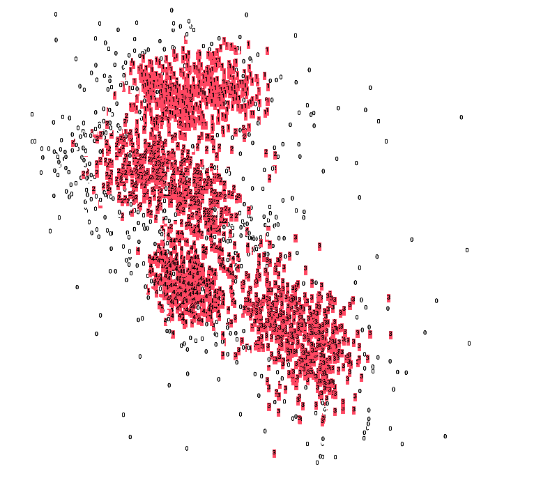
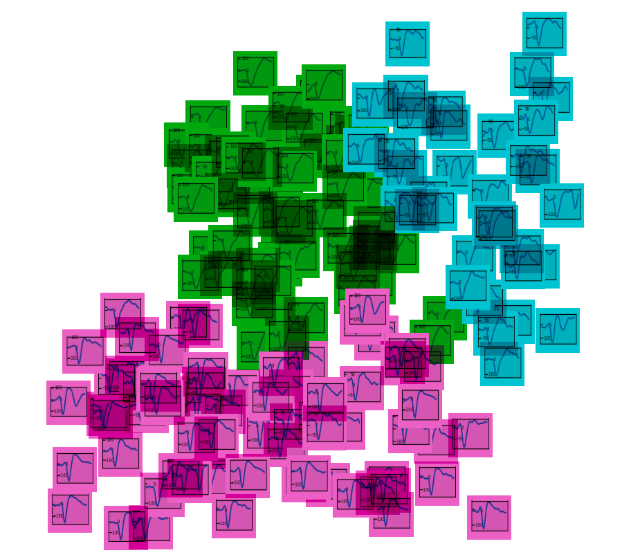

# Visualize spike waveforms with TensorBoard

Demo: http://85.217.171.57:6006/#projector (you might need to refresh the page a few times to load the content).

Ever wonder how the spiketrain waveforms of your electrophysiological recordings look like? TensorBoard can visualize samples in the PCA space where you can pick individual waveforms and compare them with the waveforms of other units (neurons) of the same channel of Utah Array.

In this demo, the 79th channel of the Utah array from Blackrock recordings in macaque motor cortex [[1]](https://gin.g-node.org/INT/multielectrode_grasp) is chosen. 2500 waveforms of all 5 units, including the noisy zero-unit, classified by Blackrock, that are found in this channel are randomly selected and shown.

### Running locally

To run the demo locally, you need to have Python 3.6+ installed, download ReachToGrasp data (see the References) elsewhere and move `datasets` folder in the same path. Then run the following commands in a terminal:

1. `pip install -r requirements.txt`
2. `python visualize.py`
3. `tensorboard --logdir=runs`
4. Open http://localhost:6006 in your browser.

### Explore waveforms in TensorBoard

Navigating to http://localhost:6006 should redirect you to http://localhost:6006/#projector (only the projector tab is filled with information).

Once in the projector tab, click on the button `A`  on the top panel to turn images off and show the labels (unit IDs) only.

Blackrock, the recording device, assigns noisy waveforms to unit `0`. Let's filter them out by clicking on the regex button `.*`  and typing `[1-9]` to select non-zero units only. This will highlight the chosen samples in red.

Click `Isolate xxx points`. Finally, click on the button `A` again to turn the images on. Explore the waveforms.

Try playing with different visualization methods - PCA, T-SNE, and UMAP. You can turn the colors on and off by clicking on the "Color by" button on the left panel.

### References

1. Massively parallel recordings in macaque motor cortex during an instructed delayed reach-to-grasp task, Scientific Data, 5, 180055. Data link: https://gin.g-node.org/INT/multielectrode_grasp
